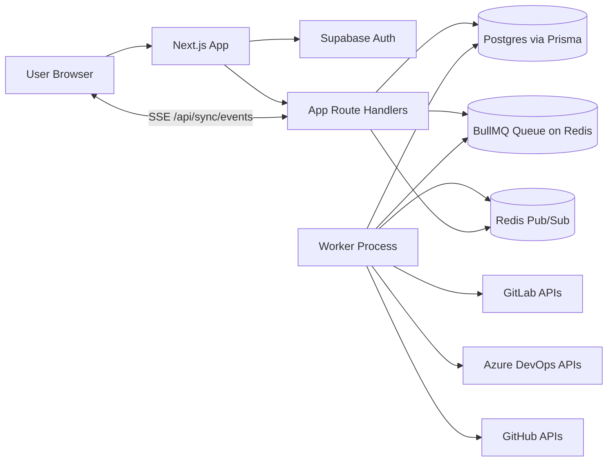
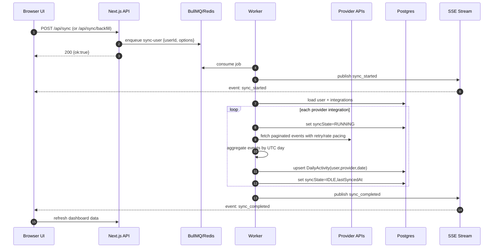
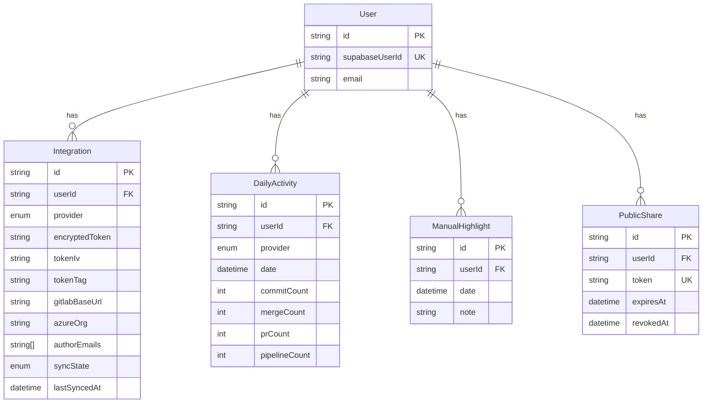

# ContributionPulse

Privacy-first contribution verification for developers with private repositories.

ContributionPulse connects to GitLab, Azure DevOps, and GitHub using read-only tokens, computes daily contribution aggregates, and exposes proof-style dashboards/reports without storing source-level metadata.

## Product goals
- Verify contribution activity from private repositories.
- Keep user data privacy-safe by design.
- Support shareable public reports and PDF export.
- Scale sync via background jobs and retries.

## Core principles
- Store only day-level aggregate counts (`commitCount`, `mergeCount`, `prCount`, `pipelineCount`).
- Never store code, diffs, commit messages, repository names, or raw provider payloads.
- Encrypt provider credentials at rest with AES-256-GCM.
- Keep all secret handling server-side only.

---

## Tech stack
- Frontend/App shell: Next.js 14 (App Router), TypeScript, Tailwind, shadcn/ui
- Auth: Supabase Auth (email magic link)
- Database: PostgreSQL + Prisma
- Queue/worker: BullMQ + Redis
- Charts: Recharts
- Client data/state: React Query (server communication), Zustand (UI state)

---

## System architecture

### High-level component diagram


### Runtime boundaries
- **Web app process**: UI rendering, API route handling, auth checks, report generation.
- **Worker process**: all sync jobs, provider API calls, aggregation, upserts.
- **Redis**: queue broker + realtime pub/sub channel.
- **Postgres**: tenant-scoped persistent storage.

---

## End-to-end flow

### 1) Auth + tenant resolution
1. User signs in via Supabase magic link.
2. Server calls `requireAppUser()` for protected pages/routes.
3. App user record is upserted by `supabaseUserId`.
4. All operations are scoped by `appUser.id`.

### 2) Onboarding
1. User submits provider credentials (GitLab/GitHub token, Azure token + org).
2. API encrypts token using AES-256-GCM (`MASTER_KEY`).
3. Integration is upserted per unique `(userId, provider)`.
4. Optional author-email aliases are stored for commit matching.

### 3) Sync
1. User clicks **Sync now** or queues **historical backfill**.
2. API enqueues BullMQ `sync-user` job.
3. Worker pulls job and iterates user integrations.
4. For each integration:
   - mark `syncState=RUNNING`
   - decrypt token in memory
   - fetch provider events with pagination + retries + pacing
   - aggregate to UTC day buckets
   - upsert into `DailyActivity`
   - set `syncState=IDLE`, `lastSyncedAt=now`
5. On failure: mark `syncState=FAILED`, emit sanitized error logs.

### 4) Realtime job status
1. Worker publishes sync lifecycle events (`started/completed/failed`) to Redis pub/sub.
2. Browser listens through SSE endpoint `/api/sync/events`.
3. Dashboard shows toasts and refreshes updated data.

### 5) Dashboard/report
1. Dashboard reads only aggregate rows (`DailyActivity`).
2. React Query handles all API calls (sync, backfill, shares, highlights, settings actions).
3. Public report uses tokenized, read-only route; no private metadata is exposed.
4. PDF export renders aggregate-only proof.

---

## Detailed sync design

### Sync sequence diagram


### Retry, pagination, and rate limiting
- Retries transient failures (`429`, `5xx`) with incremental backoff.
- Supports both page-based and continuation-token pagination.
- Applies per-host minimum interval (`minIntervalMs`) between outbound requests.

### Backfill
- Backfill submits fixed year range (`from=Jan 1`, `to=Dec 31`) as job options.
- Jobs are listed, retried, deleted, or cleaned from the dashboard.

---

## Data model

### ER diagram


### Privacy boundaries in data model
- `Integration` keeps encrypted secrets only.
- `DailyActivity` is aggregate-only.
- No model stores repository names or commit messages.

---

## API architecture

### App route groups
- `/api/integrations/*` -> connect/update/disconnect providers
- `/api/sync` + `/api/sync/backfill*` -> queue operations
- `/api/sync/events` -> SSE stream for realtime sync status
- `/api/share` -> create/revoke public report links
- `/api/highlights` -> manual highlight CRUD (currently create)
- `/api/report/pdf/[token]` -> PDF export
- `/api/account/delete` -> account/data deletion

### Client communication pattern
- React Query handles all client-initiated API communication.
- Mutations update local UI state and trigger selective refresh.
- Zustand handles non-server UI state (chart filters/year, etc.).

---

## Security architecture

### Credential encryption
- Algorithm: AES-256-GCM
- Key source: `MASTER_KEY` env var (base64, 32 bytes)
- Token encryption on write, decryption only in worker sync path.

### Logging safety
- All structured logs go through sanitization.
- Token-like values are redacted before output.

### Secret exposure controls
- Provider secrets are never sent to browser.
- Sensitive operations run in server routes/worker only.

### Public report controls
- Tokenized URL
- Optional expiration timestamp
- Revocation support

---

## Multi-tenant design
- Primary tenant key is `userId`.
- Uniques enforce per-tenant isolation (`userId + provider`, `userId + provider + date`).
- Every query/mutation path uses authenticated `appUser.id`.

---

## Provider integration notes

### GitLab
- Supports `gitlab.com` and self-hosted base URL.
- Uses events API to derive commits/merges/pipelines aggregates.

### Azure DevOps
- Requires PAT + organization name.
- Traverses projects/repositories/commits.
- Skips inaccessible repos (403/404) without failing whole sync.

### GitHub
- Uses user/repos, commits, pulls, and workflow runs endpoints.
- Handles empty/inaccessible repositories gracefully (e.g., 409/404/403 skip paths).

---

## Local development

### Prerequisites
- Node.js 20+ (project currently targets modern runtime)
- PostgreSQL
- Redis
- Supabase project (URL + anon + service role key)

### Environment variables
Copy `.env.example` to `.env.local` and set:
- `DATABASE_URL`
- `DIRECT_URL`
- `NEXT_PUBLIC_SUPABASE_URL`
- `NEXT_PUBLIC_SUPABASE_ANON_KEY`
- `SUPABASE_SERVICE_ROLE_KEY`
- `MASTER_KEY` (base64-encoded 32-byte key)
- `REDIS_URL`
- `APP_URL`
- `NEXT_PUBLIC_APP_NAME` (optional, default `ContributionPulse`)
- `NEXT_PUBLIC_APP_SLUG` (optional, default derived from app name)

Generate `MASTER_KEY`:
```bash
openssl rand -base64 32
```

### Install and run
```bash
npm install
npm run prisma:generate
npx prisma migrate deploy
npm run dev
```

### Run worker(s)
```bash
npm run worker
npm run worker:nightly
```

`worker:nightly` registers the repeatable nightly sync schedule. Run it once per environment.

---

## Testing
```bash
npm test
```

Current automated tests include:
- encryption helper correctness (AES-256-GCM)
- daily aggregation/upsert logic

---

## Deployment topology (recommended)
1. Web service: Next.js app
2. Worker service: BullMQ worker process
3. Scheduler service/job: `worker:nightly` (or one-time bootstrap)
4. Managed Postgres (e.g., Supabase Postgres)
5. Managed Redis

---
